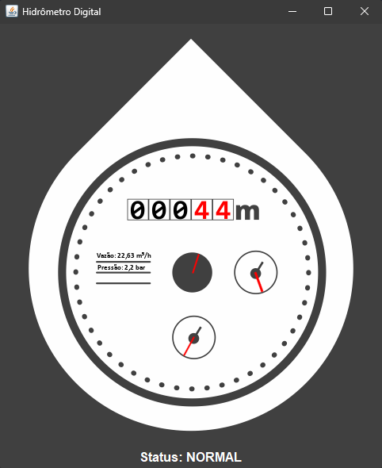
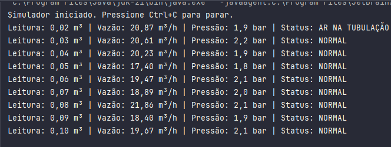

# Simulador de Hidrômetro em Java

   

## 📖 Visão Geral

Este projeto é um **Simulador de Hidrômetro Digital** desenvolvido em Java, utilizando Programação Orientada a Objetos e uma interface gráfica com **Java Swing**. O objetivo é fornecer uma representação visual interativa e funcional de um hidrômetro, que pode ser integrada a outros softwares ou usada para testes e demonstrações, eliminando a necessidade de um dispositivo físico.

O simulador carrega configurações de um arquivo de propriedades, opera de forma contínua com uma lógica de simulação em uma thread separada, e exibe os dados em uma GUI que imita um medidor real. Adicionalmente, o sistema captura e salva imagens da sua própria interface em intervalos regulares, criando um histórico visual das leituras.

## ✨ Funcionalidades Principais

-   **Interface Gráfica Interativa:** Exibe a leitura, vazão e pressão em um painel visual que imita um hidrômetro real, com ponteiros animados e dígitos formatados individualmente.
-   **Simulação Detalhada:** Contabiliza o volume de água consumido (m³) e simula a variação de vazão e pressão na rede.
-   **Simulação de Eventos:** Modela eventos aleatórios como **Falta de Água** e **Presença de Ar na Tubulação**, com feedback visual e no console.
-   **Captura de Tela Automática:** A GUI é capturada e salva automaticamente como imagens (PNG/JPEG) em um diretório configurável, registrando o estado do hidrômetro ao longo do tempo.
-   **Configuração Externa:** Todos os parâmetros da simulação são facilmente ajustáveis através de um arquivo `parametros.properties`, sem necessidade de recompilar o código.
-   **Log de Console:** Gera logs detalhados no console, mostrando o estado da rede a cada ciclo da simulação.

---

## 💻 Saídas do Simulador (Exemplos)

### Interface Gráfica (GUI)

A simulação é exibida em tempo real em uma janela, com a leitura numérica e os ponteiros animados para litros, vazão e pressão.



### Saída do Console

Paralelamente à GUI, o simulador gera logs no console, detalhando o estado da rede a cada ciclo. Isso é útil para depuração e para o uso do simulador em sistemas que não necessitam da interface visual.



---

## 🛠️ Tecnologias Utilizadas

-   **Java 11+**
-   **Java Swing** para a Interface Gráfica (GUI)
-   **Apache Maven** para gerenciamento do projeto e dependências

---

## 📂 Estrutura do Projeto

O projeto utiliza a estrutura padrão do Maven, que organiza o código-fonte, os recursos e os testes de forma clara.

```
simulador-hidrometro/
├── docs/
│   └── images/
│       └── gui_exemplo.png      # Imagem de exemplo para o README
├── out/
│   └── imagens_geradas/         # Diretório de saída para as imagens capturadas
├── src/
│   ├── main/
│   │   ├── java/
│   │   │   └── br.com.hidrometro/  # Pacote raiz do código-fonte
│   │   │       ├── model/
│   │   │       ├── util/
│   │   │       ├── view/
│   │   │       ├── Main.java
│   │   │       └── Simulador.java
│   │   └── resources/              # Recursos do projeto
│   │       ├── config/
│   │       │   └── parametros.properties # Arquivo de configuração
│   │       └── hidrometro.png      # Imagem de fundo da GUI
├── .gitignore
├── pom.xml                         # Arquivo de configuração do Maven
└── README.md
```

---

## 🚀 Como Executar o Projeto

### Pré-requisitos

-   **Java Development Kit (JDK)** - Versão 11 ou superior.
-   **IntelliJ IDEA** (ou outra IDE com suporte a Maven).

### Passos para Execução

1.  **Clone o Repositório:**
    ```bash
    git clone [URL_DO_SEU_REPOSITORIO] simulador-hidrometro
    cd simulador-hidrometro
    ```

2.  **Abra no IntelliJ IDEA:**
    -   Abra o IntelliJ e selecione `File > Open...`.
    -   Navegue até a pasta `simulador-hidrometro` e a selecione.
    -   A IDE detectará o arquivo `pom.xml` e configurará o projeto Maven automaticamente.

3.  **Verifique os Recursos:**
    -   Certifique-se de que `hidrometro.png` esteja em `src/main/resources/`.
    -   Certifique-se de que `parametros.properties` esteja em `src/main/resources/config/`.

4.  **Execute:**
    -   Encontre o arquivo `Main.java` (`src/main/java/br/com/hidrometro/Main.java`).
    -   Clique com o botão direito sobre ele e selecione `Run 'Main.main()'`.

5.  **Observe a Saída:**
    -   A janela da **interface gráfica** será exibida.
    -   O **console** da IDE mostrará os logs de status.
    -   As **capturas de tela** serão salvas na pasta `out/imagens_geradas/`.

---

## ⚙️ Configuração

O comportamento do simulador é controlado pelo arquivo `src/main/resources/config/parametros.properties`.

```properties
# Parâmetros de Simulação do Hidrômetro

# Vazão média da água em m³/hora.
vazao.media=20.0

# Pressão média da água em bar.
pressao.media=2.0

# Caminho para salvar as imagens capturadas (relativo à raiz do projeto).
path.saida.imagens=out/imagens_geradas/

# Prefixo do nome do arquivo de imagem.
prefixo.nome.imagem=leitura_

# Formato da imagem (png ou jpg).
formato.imagem=png

# Intervalo em segundos para a atualização e captura da GUI.
intervalo.geracao.imagem.segundos=2

# Probabilidade de ocorrer falta de água a cada ciclo (0.0 = 0%, 1.0 = 100%).
probabilidade.falta.de.agua=0.01

# Probabilidade de ter ar na tubulação a cada ciclo.
probabilidade.presenca.de.ar=0.05

# Fator multiplicador para o consumo quando há ar (1.3 = 30% a mais).
fator.consumo.com.ar=1.3
```

---

## 📈 Arquitetura e Diagrama de Classes (UML)

A arquitetura do software segue o princípio da separação de responsabilidades, dividindo o código em `model` (lógica de negócio), `view` (GUI e captura) e `util` (configuração), orquestrados pelo `Simulador`.


```
## Créditos

- Estudante/desenvolvedor:
Cefras José Ferreira Mandú de Almeida

- Professor responsável:
Katyusco de Farias Santos
